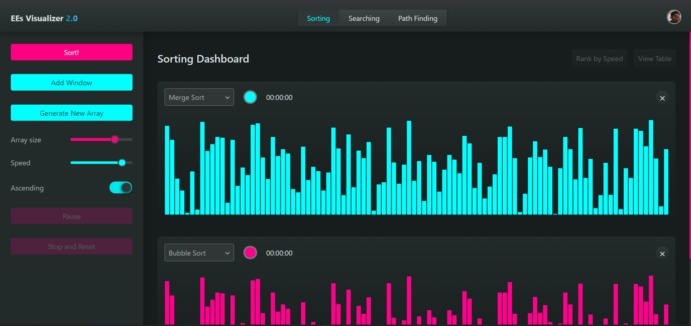
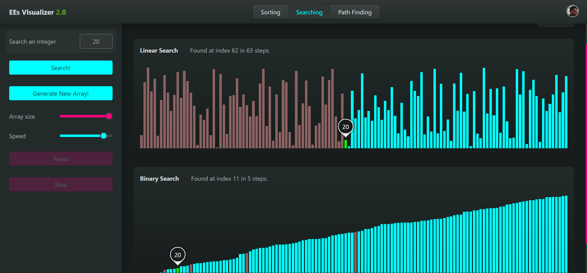
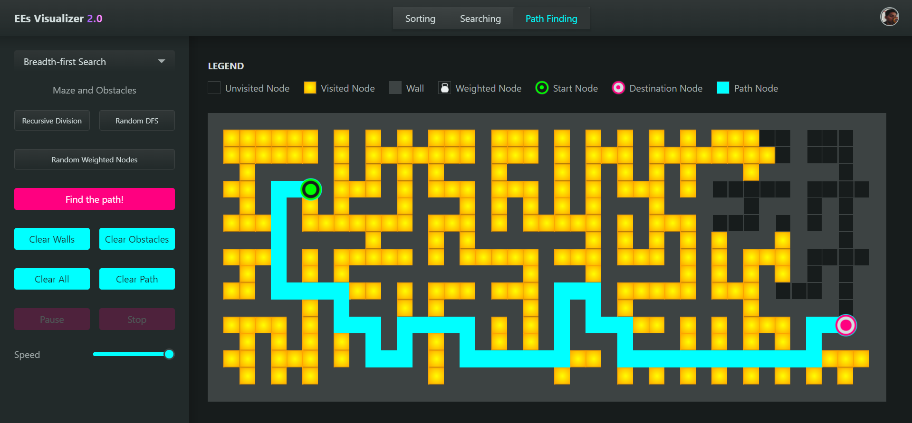

[](https://ees-visualizer.netlify.app)

#### An interactive visualization tool for fundamental algorithms in sorting, searching and path-finding.

Try it your self [EEs Visualizer v2.0](https://ees-visualizer.netlify.app)

## Visualizers

- [Sorting Visualizer](https://ees-visualizer.netlify.app/sorting)

[](https://ees-visualizer.netlify.app/sorting)

- [Searching Visualizer](https://ees-visualizer.netlify.app/searching)

[](https://ees-visualizer.netlify.app/searching)

- [Path Finding Visualizer](https://ees-visualizer.netlify.app/path-finding)

[](https://ees-visualizer.netlify.app/path-finding)


## About the App

EEs Visualizer is a tool for visualizing Fundamental Algorithms in Sorting, Searching, and Path Finding. This involves comparison between different algorithms and visulization of how each of them works. You can compare the algorithms' speed or how one is better than others. There are cool animations for visualizing algorithms. You can customize each of the visualizers' settings and inputs according to your preferences. Input some data, visualize how it works, and analyze base on the results.

## Local usage

1. Clone this project: ```git clone https://github.com/EricEchemane/EEs-Visualizer-V.2.git```
2. Install dependencies: ```cd ./EEs Visualizer v2.0 && npm install```
3. Run locally: ```npm run dev```